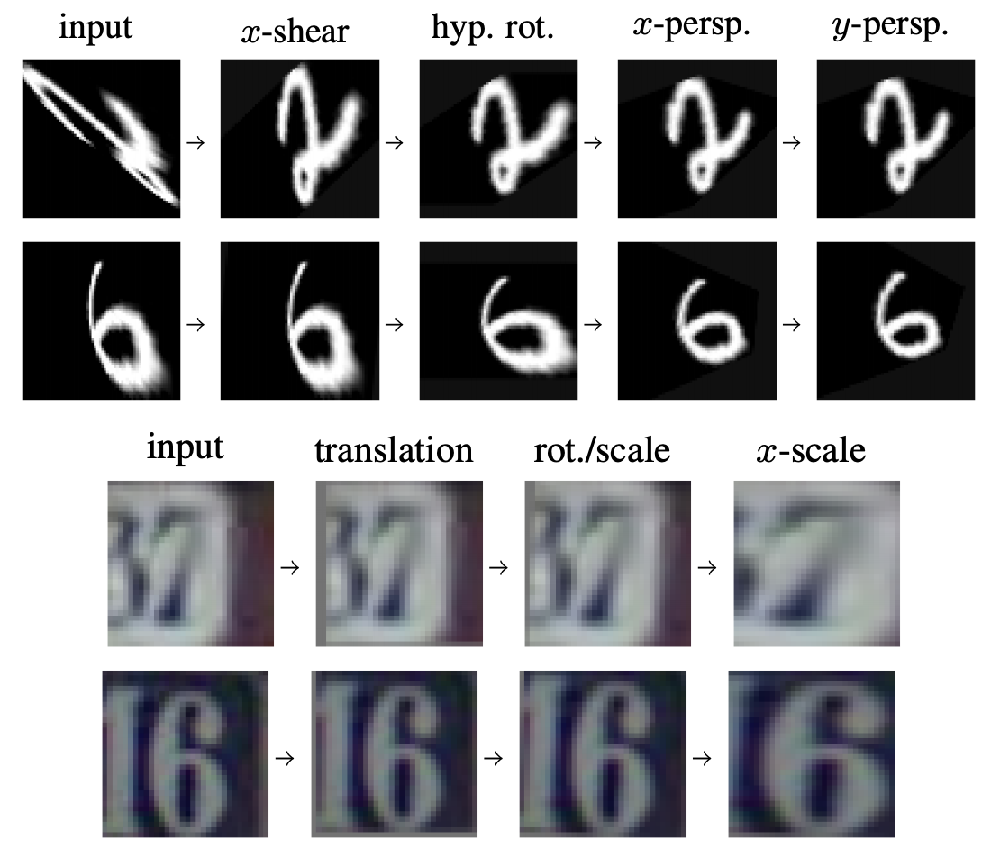
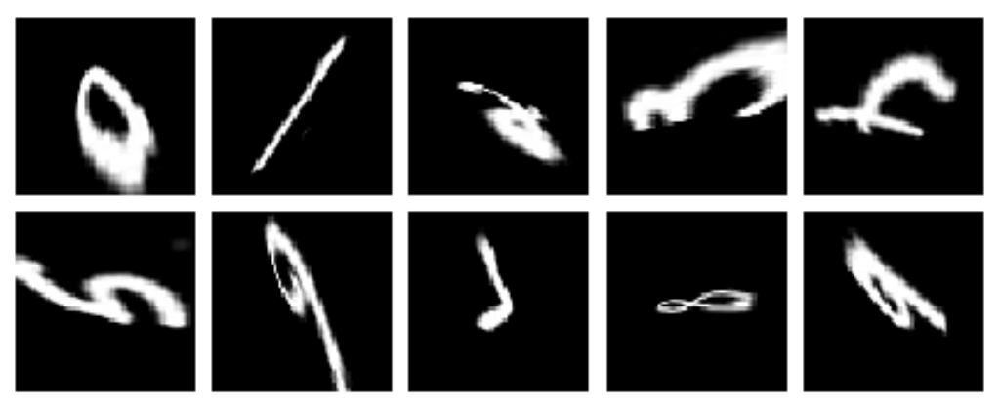

# Equivariant Transformer Networks

Equivariant Transformer (ET) layers are image-to-image mappings that incorporate prior knowledge on invariances with respect to continuous transformation groups.
ET layers can be used to normalize the appearance of images prior to classification (or other operations) by a convolutional neural network.

More details can be found in our ICML 2019 paper: https://arxiv.org/abs/1901.11399.

<p align="center">
  
</p>

---

## Requirements

- python >=3.6
- pytorch >=1.0 (https://pytorch.org/get-started/locally/)
- fire (`pip install fire` / `conda install fire -c conda-forge`)

---

## Datasets

<p align="center">
  
</p>

To download and preprocess datasets, run:

```bash
python datasets.py projective_mnist --data_dir=<PATH>
``` 

for the Projective MNIST dataset, and

```bash
python datasets.py svhn --data_dir=<PATH>
```

for the SVHN dataset.

This will download the requested dataset to the directory indicated by `PATH` and will write three files: `train.pt`, `valid.pt` and `test.pt`.
These files will be used by the experiment scripts.

---

## Pretrained Models

Pretrained models can be found in the `pretrained` directory.

These can be loaded by simply setting the `load_path` argument for the corresponding `Model` subclass:

```python
from experiment_mnist import MNISTModel
from experiment_svhn import SVHNModel

mnist_model = MNISTModel(load_path='pretrained/etn-projmnist-8x.pt')
svhn_model = SVHNModel(load_path='pretrained/etn-resnet34-svhn.pt')
```

---

## Usage

There are two scripts for running the experiments described in the paper: `experiment_mnist.py` and `experiment_svhn.py`.
These scripts come with preset hyperparameters for each task that can be overridden by setting the corresponding flags.

To train a model on the Projective MNIST dataset, run:

```bash
python experiment_mnist.py train --train_path <PATH>/train.pt --valid_path <PATH>/valid.pt [--save_path <SAVE_PATH>]
```

The `save_path` flag lets us specify a path to save the model that achieves the best validation accuracy during training.

To change the set of transformers used by the model, we can use the `tfs` flag to specify a list of class names from the `etn.transformers` module. For example:

```bash
python experiment_mnist.py train ... --tfs "[ShearX, HyperbolicRotation]"
```

To train a model without any transformers, we can simply set `tfs` to the empty list `[]`:

```bash
python experiment_mnist.py train ... --tfs []
```

We can also set the coordinate transformation that's applied immediately prior to classification by the CNN:

```bash
python experiment_mnist.py train ... --coords logpolar
```

Therefore, to train a bare-bones model without any transformer layers or coordinate transformations, we can run:

```bash
python experiment_mnist.py train ... --tfs [] --coords identity
```

Feel free to play around with different combinations of transformers and coordinate systems!

To train a non-equivariant model, we can set the `equivariant` flag to `False`:

```bash
python experiment_mnist.py train ... --equivariant False
```

To change the device used for training, we can set the `device` flag (this is set to `cuda:0`) by default:

```bash
python experiment_mnist.py train ... --device cuda:1
```

To evaluate a saved model on the test set, run:

```bash
python experiment_mnist.py --load_path <SAVE_PATH> test --test_path <PATH>/test.pt
```

The experiments on the SVHN dataset can be run in same manner by calling `experiment_svhn.py` instead of `experiment_mnist.py`.

These scripts can also be called from a Jupyter Notebook by importing the `MNISTModel` and `SVHNModel` classes.
In a notebook, we can visualize training progress using the `show_plot` parameter.
This produces a live plot of the loss and validation error as training progresses.

```python
from experiment_mnist import MNISTModel
model = MNISTModel(...)
model.train(..., show_plot=True, ...)
```

For more training options, see the `__init__` and `train` functions for the base `experiments.Model` class and its subclasses in `experiment_mnist` and `experiment_svhn`.

---

## Citation

If you've found this repository useful in your own work, please consider citing our paper:

```
@inproceedings{tai2019equivariant,
  title={{Equivariant Transformer Networks}},
  author={Tai, Kai Sheng and Bailis, Peter and Valiant, Gregory},
  booktitle={International Conference on Machine Learning},
  year={2019}
}
```


